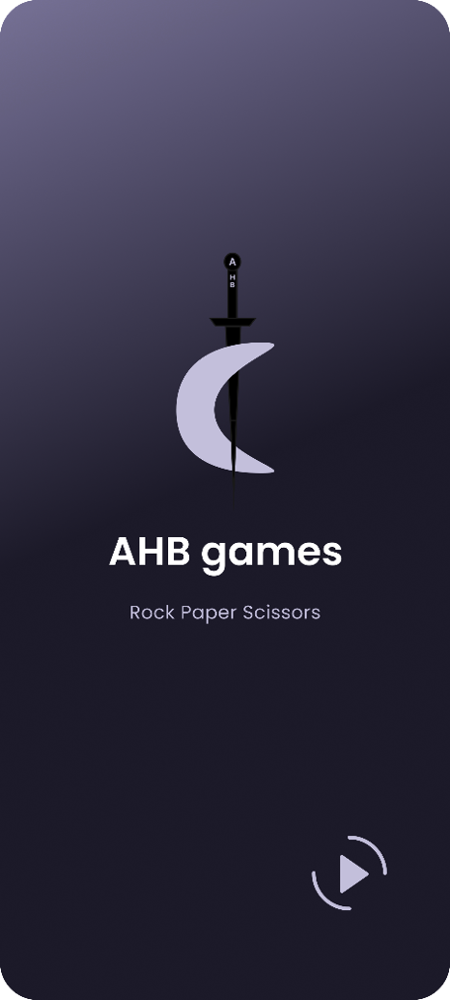
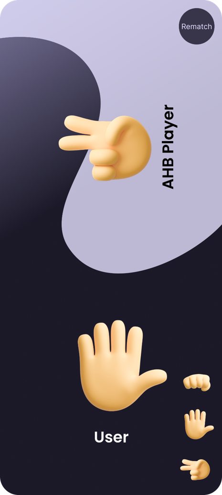

# ✊✋✌️ Rock Paper Scissors – Android Game

A classic **Rock Paper Scissors** game developed using **Java** in **Android Studio**, designed for offline fun with a clean and intuitive user interface. The player competes against the app in this simple, fast-paced, and interactive experience.

---

## 🎮 Features

- Play Rock, Paper, Scissors against the app
- Randomized opponent choices
- Clean and minimal UI
- Instant win/loss/draw feedback
- Lightweight and fully offline

---

## 🛠 Tech Stack

- Java (Game logic)
- Android Studio
- XML (UI Design)

---

## 📸 Screenshots

  
  
  

> Screenshots are for display purposes – the source code is private.

---

## 🚧 Status

Fully functional and complete. Possible future improvements may include multiplayer mode or custom themes.
